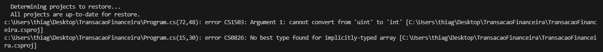
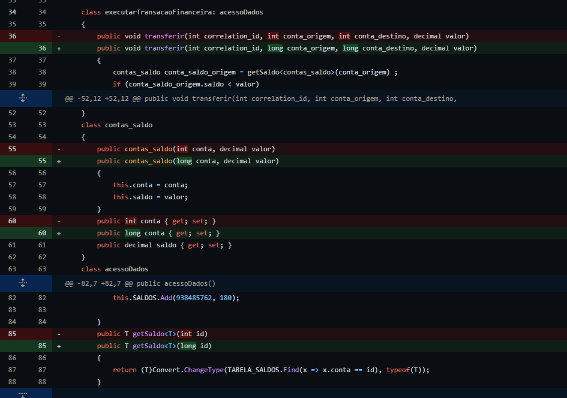
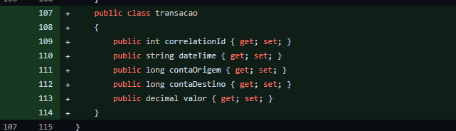
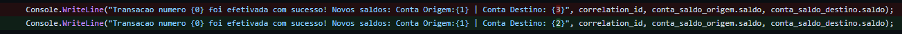
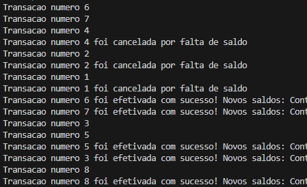

# TransacaoFinanceira
Case para refatoração

Passos a implementar:
1. Corrija o que for necessario para resolver os erros de compilação.
2. Execute o programa para avaliar a saida, identifique e corrija o motivo de algumas transacoes estarem sendo canceladas mesmo com saldo positivo e outras sem saldo sendo efetivadas.
3. Aplique o code review e refatore conforme as melhores praticas(SOLID,Patterns,etc).
4. Implemente os testes unitários que julgar efetivo.
5. Crie um git hub e compartilhe o link respondendo o ultimo e-mail.

Obs: Voce é livre para implementar na linguagem de sua preferência desde que respeite as funcionalidades e saídas existentes, além de aplicar os conceitos solicitados.

# Erros na compilação

De início, esses foram os erros ao compilar:

Erro CS1503 foi ajustado alterando o tipo de int para long 

Erro CS0826 foi ajustado criando uma nova classe de transação

Ao rodar o código, apareceu outro erro:

Corrigido ao ajustar o índice 

# Refatoração

O Parallel.ForEach rodava as transações fora de ordem, o que gerava erros indevidos como um débito de conta que gerava falta de saldo, sendo que a conta deveria ter recebido uma transferência antes.

Alterei para um For Loop para garantir a ordem das execuções.